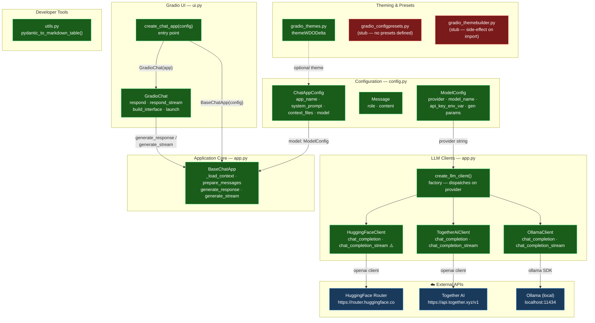

# gradiochat — Architecture Overview

A Python package for building configurable LLM-powered Gradio chat applications. Developed with **nbdev** — Jupyter notebooks under `nbs/` are the source of truth; Python files under `src/gradiochat/` are auto-generated via `nbdev_prepare`.

## System Architecture

**Legend**: 🟢 Done | 🟡 Partial/Broken | 🔴 Stub/Not Started | 🔵 External

## Layer Details

### Configuration (`config.py`)

Three Pydantic v2 models that act as the single source of truth for all app configuration:

- **`ModelConfig`** — LLM provider, model name, API key env var, and all generation parameters (temperature, top_p, top_k, max tokens, stop sequences, streaming flag). The `api_key` property reads from the environment at runtime — no key is stored in the model.
- **`Message`** — Immutable typed DTO for a single chat turn. Role is constrained to `Literal["system", "user", "assistant"]`.
- **`ChatAppConfig`** — Top-level config: app metadata, system prompt, optional starter prompt, context file paths, logo, Gradio theme, and a nested `ModelConfig`.

### LLM Clients (`app.py`)

Three concrete clients behind a `LLMClientProtocol` (structural `Protocol`). All share the same interface: `chat_completion()` → `str` and `chat_completion_stream()` → `Generator[str, None, None]`.

- **`HuggingFaceClient`** — Uses the `openai` package pointed at HF's inference router. ⚠️ Streaming falls back to non-streaming (a `yield result` stub).
- **`TogetherAiClient`** — Uses `openai` against Together AI's endpoint. Full streaming via `stream=True`.
- **`OllamaClient`** — Uses the official `ollama` Python SDK against a local server. Full streaming support.

`create_llm_client(model_config)` is a factory that dispatches on `model_config.provider`.

### Application Core (`app.py`)

**`BaseChatApp`** orchestrates:

1. Loading context from markdown files on init (`_load_context`)
2. Composing the message list — system prompt + context + history + current user turn (`prepare_messages`)
3. Delegating to the LLM client for completion (`generate_response`) or streaming (`generate_stream`)

### Gradio UI (`ui.py`)

**`GradioChat`** wraps `BaseChatApp` and builds a `gr.Blocks` interface with:

- Logo + title/description header row
- `gr.Chatbot` (OpenAI-style messages, editable, with copy buttons)
- Text input, Submit and Clear buttons
- Export accordion with `DownloadButton` (saves full conversation as a dated Markdown file in `tempdir`)
- System prompt / context accordion (collapsible)

`create_chat_app(config)` is the primary public entry point — creates `BaseChatApp` then `GradioChat`.

### Theming & Presets

- **`gradio_themes.py`** — `themeWDODelta`: a fully configured custom orange/slate Gradio theme.
- **`gradio_configpresets.py`** — Stub; `__all__` is empty; intended for pre-built `ModelConfig` presets but none are defined.
- **`gradio_themebuilder.py`** — Stub; calls `gr.themes.builder()` at module import time (side-effect bug).

### Developer Tools (`utils.py`)

`pydantic_to_markdown_table()` — Introspects any Pydantic `BaseModel` and renders an IPython-formatted Markdown table of fields, types, defaults, and descriptions. Used in development notebooks.

## Module Status Summary

| Module | Status | Notes |
| --- | --- | --- |
| `config.py` | 🟢 Done | Pydantic v2 models, full validation |
| `app.py` | 🟢 Done | HuggingFace streaming silently falls back to non-streaming |
| `ui.py` | 🟢 Done | Full Gradio interface with Markdown export |
| `utils.py` | 🟢 Done | Dev helper for Jupyter notebooks |
| `gradio_themes.py` | 🟢 Done | `themeWDODelta` fully configured |
| `gradio_configpresets.py` | 🔴 Stub | `__all__ = []`, no presets defined |
| `gradio_themebuilder.py` | 🔴 Stub | Calls `gr.themes.builder()` on import (side-effect) |
| `__init__.py` | 🔴 Stub | Version string + no-op `main()`, no public re-exports |

## Key Issues

1. **`HuggingFaceClient.chat_completion_stream`** yields the full non-streaming result — streaming is silently broken for this provider.
2. **`gradio_themebuilder.py`** calls `gr.themes.builder()` at module import time, launching a Gradio server as a side effect.
3. **`gradio_configpresets.py`** exports nothing (`__all__ = []`) — the intended pre-built provider presets are not implemented.
4. **`__init__.py`** does not re-export the public API — users must import from submodules directly (`from gradiochat.ui import create_chat_app`).
5. **`tests/`** directory is empty — no automated tests exist.

## Recommended Next Steps

1. Fix `HuggingFaceClient.chat_completion_stream` to pass `stream=True` to the OpenAI client (same pattern as `TogetherAiClient`).
2. Guard `gr.themes.builder()` in `gradio_themebuilder.py` inside a function so it isn't invoked on import.
3. Implement `gradio_configpresets.py` with at least one preset `ModelConfig` per supported provider.
4. Re-export `create_chat_app`, `ModelConfig`, `ChatAppConfig`, and `Message` from `__init__.py`.
5. Add tests under `tests/` — at minimum for `config.py` validation and `create_llm_client()` dispatch logic.
