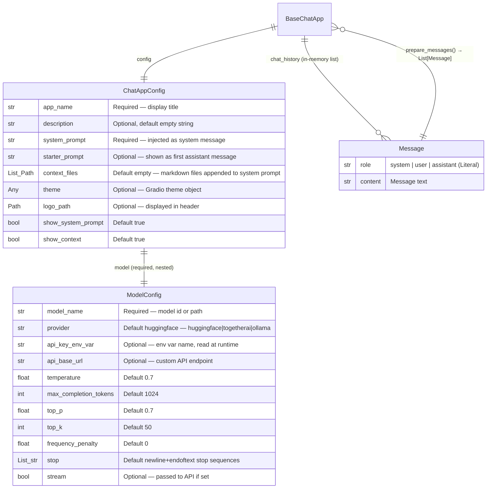

# gradiochat — Data Model

gradiochat uses **Pydantic v2** for all data modeling. There is no database; the models represent configuration and the in-memory message format used when calling LLM APIs.

## Entity Relationship Diagram

## Entity Descriptions

### `ModelConfig`

The LLM connection configuration. The `api_key` property reads from the environment variable named by `api_key_env_var` at call time — no secret is stored in the model itself. The `provider` field drives `create_llm_client()` dispatch:

| Provider value | Client class |
| --- | --- |
| `"huggingface"` | `HuggingFaceClient` |
| `"togetherai"` | `TogetherAiClient` |
| `"ollama"` | `OllamaClient` |

### `Message`

A minimal immutable DTO for a single chat turn. Role is constrained to `Literal["system", "user", "assistant"]`. Used both as the internal message format passed to LLM clients and exposed in the public `BaseChatApp` API.

### `ChatAppConfig`

The root configuration object passed to `BaseChatApp` and `GradioChat`. Owns a nested `ModelConfig`. The `context_files` field is a list of `Path` objects; their contents are loaded and appended to the system prompt at `BaseChatApp` init time. Missing files are silently skipped.

## Relationships

| Relationship | Cardinality | Notes |
| --- | --- | --- |
| `ChatAppConfig` → `ModelConfig` | 1-to-1 (nested, required) | Validated at model instantiation |
| `BaseChatApp` → `ChatAppConfig` | 1-to-1 | Passed in constructor |
| `BaseChatApp.chat_history` → `Message` | 1-to-many | In-memory only; reset on restart |
| `BaseChatApp.prepare_messages()` → `Message` | Constructs list | System + history + current user turn |

## Known Issues

- `ChatAppConfig.theme` is typed `Optional[Any]` — no validation of Gradio theme objects at config time.
- `chat_history` is stored in-memory on the `BaseChatApp` instance; there is no persistence across sessions.
- `context_files` paths are validated only inside `_load_context()` (silently skipped if missing), not at Pydantic model instantiation — missing files produce no warning.
- `ModelConfig.top_k` is documented but not passed through to the HuggingFace or Together AI OpenAI-compatible clients (which do not expose `top_k`). Only `OllamaClient` could support it via the `options` dict, but it is not currently forwarded there either.
